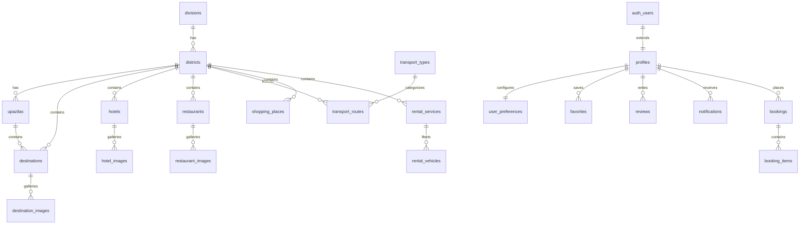

# 🛡️ YEANA — Supabase Production Backend & Frontend Integration Guide

This document is the official reference manual for deploying, securing, and managing the **YEANA Bangladesh Tour & Travel Platform** backend with **Supabase PostgreSQL** and integrating both the **React Native mobile app** and **React Web/Capacitor app**.

---

## 📋 Table of Contents
1. [Complete Database Schema Architecture](#1-complete-database-schema-architecture)
2. [SQL Migration Files Suite](#2-sql-migration-files-suite)
3. [Row Level Security (RLS) Policies](#3-row-level-security-rls-policies)
4. [Supabase Storage Bucket Configuration](#4-supabase-storage-bucket-configuration)
5. [Frontend Supabase Integration](#5-frontend-supabase-integration)
6. [Environment Variables Setup](#6-environment-variables-setup)
7. [Admin Role & Privilege Setup](#7-admin-role--privilege-setup)
8. [Deployment Instructions](#8-deployment-instructions)
9. [Backup & Disaster Recovery Procedures](#9-backup--disaster-recovery-procedures)
10. [Security Audit Checklist](#10-security-audit-checklist)

---

## 1. Complete Database Schema Architecture

The database is normalized into **22 dedicated relational tables**:



### Key Highlights:
- **Primary Keys**:
  - `BIGSERIAL` identity keys for fixed geographic hierarchy (`divisions`, `districts`, `upazilas`, `transport_types`).
  - `UUID` (`gen_random_uuid()`) for business entities (`destinations`, `hotels`, `restaurants`, `bookings`, `reviews`, etc.).
- **Timestamps**: `created_at` and `updated_at` with automated trigger on all mutable tables.
- **Constraints**: Numeric precision for prices (`NUMERIC(10,2)`), check constraints on statuses and ratings.
- **Zero Raw Image Binaries in DB**: All media URLs point to Supabase Storage objects.

---

## 2. SQL Migration Files Suite

All database changes are tracked in versioned migrations located in [`supabase/migrations/`](file:///c:/Users/mdyea/OneDrive/Desktop/YEANA/supabase/migrations):

1. **[`20261007000001_core_schema.sql`](file:///c:/Users/mdyea/OneDrive/Desktop/YEANA/supabase/migrations/20261007000001_core_schema.sql)**
   - Normalized table definitions, foreign keys with `ON DELETE` rules.
   - `handle_new_user()` trigger on `auth.users` to initialize `profiles` and `user_preferences`.
   - `handle_updated_at()` trigger for automated timestamps.
   - B-tree performance indexes on foreign keys, categories, prices, ratings, and statuses.

2. **[`20261007000002_row_level_security.sql`](file:///c:/Users/mdyea/OneDrive/Desktop/YEANA/supabase/migrations/20261007000002_row_level_security.sql)**
   - RLS enabled across all application tables.
   - `is_admin()` security definer function preventing RLS recursion.
   - Role-based policies for Public, Authenticated Users, and Administrators.

3. **[`20261007000003_storage_buckets.sql`](file:///c:/Users/mdyea/OneDrive/Desktop/YEANA/supabase/migrations/20261007000003_storage_buckets.sql)**
   - Provisions 7 storage buckets in `storage.buckets`.
   - Sets MIME-type and size limits (2MB - 10MB).
   - RLS policies on `storage.objects` for public reads and authenticated/admin uploads.

4. **[`20261007000004_seed_location_hierarchy.sql`](file:///c:/Users/mdyea/OneDrive/Desktop/YEANA/supabase/migrations/20261007000004_seed_location_hierarchy.sql)**
   - 8 Administrative Divisions of Bangladesh.
   - 64 Districts with GPS coordinates, descriptions, and popular visiting seasons.
   - 495+ Upazilas with transit hub flags (railway, launch ghat).

5. **[`20261007000005_seed_travel_data.sql`](file:///c:/Users/mdyea/OneDrive/Desktop/YEANA/supabase/migrations/20261007000005_seed_travel_data.sql)**
   - Initial transport types, normalized destinations, high-res destination images.
   - Verified hotels and hotel photo galleries.
   - Regional traditional restaurants and food photos.
   - Intercity transport routes (Bus, Train, Flight, Launch).
   - Traditional handicraft shopping places and vehicle rental services.

---

## 3. Row Level Security (RLS) Policies

### Public Permissions
- `SELECT` on `divisions`, `districts`, `upazilas`, `transport_types`
- `SELECT` on `destinations`, `destination_images` where `is_active = true`
- `SELECT` on `hotels`, `hotel_images` where `is_active = true`
- `SELECT` on `restaurants`, `restaurant_images` where `is_active = true`
- `SELECT` on `transport_routes`, `shopping_places`, `rental_services`, `rental_vehicles` where `is_active = true`
- `SELECT` on `reviews` where `is_approved = true`
- `SELECT` on `profiles` (public author name and avatar)

### Authenticated User Permissions
- `SELECT`, `UPDATE` on `profiles` where `id = auth.uid()`
- `SELECT`, `INSERT`, `UPDATE` on `user_preferences` where `user_id = auth.uid()`
- `SELECT`, `INSERT`, `DELETE` on `favorites` where `user_id = auth.uid()`
- `INSERT`, `UPDATE`, `DELETE` on `reviews` where `user_id = auth.uid()`
- `SELECT`, `INSERT`, `UPDATE` on `bookings` where `user_id = auth.uid()`
- `SELECT`, `INSERT` on `booking_items` where parent booking belongs to `auth.uid()`
- `SELECT`, `UPDATE` on `notifications` where `user_id = auth.uid()`

### Admin Permissions (Server-Enforced)
- `ALL` operations (SELECT, INSERT, UPDATE, DELETE) across all tables where `public.is_admin() = true`.

---

## 4. Supabase Storage Bucket Configuration

The platform provisions 7 public media storage buckets:

| Bucket ID | Public | Max File Size | Allowed MIME Types | Purpose |
|---|---|---|---|---|
| `destination-images` | Yes | 5 MB | JPEG, PNG, WEBP, AVIF | Tourist attraction cover and gallery photos |
| `hotel-images` | Yes | 5 MB | JPEG, PNG, WEBP, AVIF | Hotel exterior, bedroom, suite, and pool photos |
| `restaurant-images` | Yes | 5 MB | JPEG, PNG, WEBP, AVIF | Restaurant ambiance and signature dish photos |
| `shopping-images` | Yes | 5 MB | JPEG, PNG, WEBP, AVIF | Handicraft, market, and souvenir images |
| `rental-images` | Yes | 5 MB | JPEG, PNG, WEBP, AVIF | Chander Gari, 4x4 Jeep, and boat images |
| `profile-images` | Yes | 2 MB | JPEG, PNG, WEBP | User avatar pictures (`profile-images/<user_id>/*`) |
| `app-assets` | Yes | 10 MB | JPEG, PNG, WEBP, SVG | Logos, division banners, and application badges |

---

## 5. Frontend Supabase Integration

### React Native Mobile App (`/mobile`)
- **Client**: [`mobile/src/lib/supabase.ts`](file:///c:/Users/mdyea/OneDrive/Desktop/YEANA/mobile/src/lib/supabase.ts) configured with `@react-native-async-storage/async-storage` and `react-native-url-polyfill`.
- **Auth Provider**: [`mobile/src/context/AuthContext.tsx`](file:///c:/Users/mdyea/OneDrive/Desktop/YEANA/mobile/src/context/AuthContext.tsx) managing user state, signup, login, session recovery, and role checking.
- **Service Layer**: [`mobile/src/services/api.ts`](file:///c:/Users/mdyea/OneDrive/Desktop/YEANA/mobile/src/services/api.ts) with pagination, category filtering, search, and booking mutations.

### React Web & Capacitor Android App (`/src`)
- **Client**: [`src/lib/supabase.ts`](file:///c:/Users/mdyea/OneDrive/Desktop/YEANA/src/lib/supabase.ts).
- **Service Layer**: [`src/services/supabaseService.ts`](file:///c:/Users/mdyea/OneDrive/Desktop/YEANA/src/services/supabaseService.ts).
- **Database Types**: [`src/types/database.ts`](file:///c:/Users/mdyea/OneDrive/Desktop/YEANA/src/types/database.ts).

---

## 6. Environment Variables Setup

Create a `.env` file in the root workspace:

```env
# Supabase Project Configuration
SUPABASE_URL=https://your-project-ref.supabase.co
SUPABASE_ANON_KEY=your-anon-publishable-key

# Vite Frontend (Web / Capacitor Android)
VITE_SUPABASE_URL=https://your-project-ref.supabase.co
VITE_SUPABASE_ANON_KEY=your-anon-publishable-key

# React Native (Expo)
EXPO_PUBLIC_SUPABASE_URL=https://your-project-ref.supabase.co
EXPO_PUBLIC_SUPABASE_ANON_KEY=your-anon-publishable-key
```

---

## 7. Admin Role & Privilege Setup

Admin status is stored directly in the `public.profiles` table (`role = 'admin'`).

### How to Assign an Administrator
After registering an account via the app or Supabase Auth dashboard:
Run the following SQL statement in the **Supabase Web SQL Editor**:

```sql
UPDATE public.profiles
SET role = 'admin'
WHERE email = 'admin@yeana.com.bd';
```

Once updated, the user will instantly gain administrative access to the Admin Dashboard Screen in the mobile app and Admin View in the web app, and PostgreSQL RLS policies will grant full CRUD permissions.

---

## 8. Deployment Instructions

### Applying Migrations to Production Supabase
```bash
# Link your live project
npx supabase link --project-ref your-project-ref

# Push migrations
npx supabase db push
```

### Deploying the Web Application (Vercel)
```bash
# Build production bundle
npm run build

# Deploy via Vercel CLI
npx vercel --prod
```

### Deploying the Mobile Application (Google Play / Android)
```bash
# 1. Sync Capacitor Android build
npm run android:sync

# 2. Or build React Native standalone APK/AAB via Expo EAS:
cd mobile
npx eas-cli build --platform android
```

---

## 9. Backup & Disaster Recovery Procedures

1. **Automated Backups**: Ensure Daily Automated Backups are enabled in Supabase Project Settings → Database → Backups.
2. **Manual Snapshot Export**:
   ```bash
   npx supabase db dump -f supabase/backups/backup_$(date +%Y%m%d).sql
   ```
3. **Database Restore**:
   ```bash
   psql -h <db-host> -U postgres -d postgres -f supabase/backups/backup_YYYYMMDD.sql
   ```

---

## 10. Security Audit Checklist

- [x] **No Service Role Key Exposed**: Frontend uses ONLY `anon` publishable key.
- [x] **RLS Enabled**: Enabled on all 22 database tables and all 7 storage buckets.
- [x] **Infinite Recursion Guard**: `is_admin()` declared as `SECURITY DEFINER STABLE` with static search path.
- [x] **Profile Protection**: Users cannot update their own `role` to `admin` without admin privilege.
- [x] **Password Rules**: Supabase Auth handles bcrypt hashing and secure JWT issuance.
- [x] **Injection Prevention**: All queries use parameterized Supabase client bindings.
- [x] **Storage Object Isolation**: User avatars isolated in `profile-images/<user_id>/*`.
- [x] **Zero Binary Blobs**: All pictures stored as paths/URLs in Supabase Storage.
